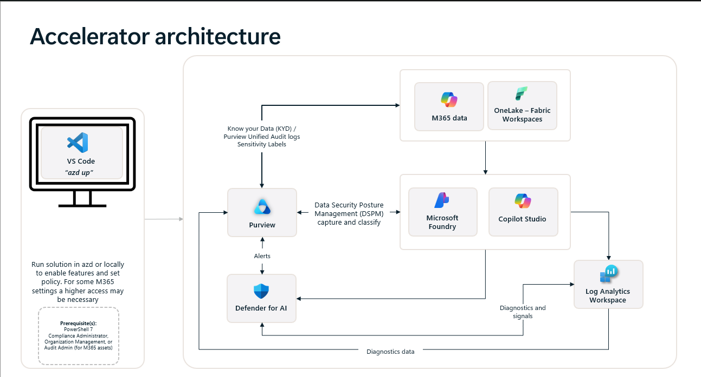

# Data Agent Governance and Security Accelerator

Enable Microsoft Purview Data Security Posture Management (DSPM) for AI across Microsoft 365 Copilot, Microsoft Foundry, Microsoft Fabric, and custom AI solutions with a spec-driven deployment and governance workflow.

Includes Fabric lakehouse Sensitivity Labels configuration and application through the `spec.local.json` workflow.

<div align="center">

[**START HERE**](#start-here) | [**GETTING STARTED**](#getting-started) | [**GUIDANCE**](#guidance) | [**RESOURCES**](#resources)

</div>

---

## Important Security Notice

This template, the application code and configuration it contains, has been built to showcase Microsoft Azure specific services and tools. We strongly advise our customers not to make this code part of their production environments without implementing or enabling additional security features.

For a more comprehensive list of best practices and security recommendations for Intelligent Applications, [visit our official documentation](https://learn.microsoft.com/en-us/azure/ai-foundry/).

---

## Start Here

This accelerator is designed for security, compliance, and data governance teams that need to onboard AI workloads faster, apply consistent controls, and export evidence for audit or regulatory review.

### What this accelerator does

- Configures Microsoft Purview DSPM for AI onboarding and governance automation
- Governs Microsoft Foundry resources with Defender for Cloud, diagnostics, tagging, and Content Safety integration
- Supports Fabric workspace and lakehouse sensitivity workflows through `spec.local.json`
- Exports audit and compliance evidence for downstream review

### What to expect

- The repo is optimized for governance automation rather than application-only samples
- The fastest path still includes validation and a few manual follow-up steps in Microsoft Purview and Defender for Cloud
- Some scenarios require Azure, Purview, and Microsoft 365 permissions that may involve more than one operator

### Recommended first path

For a first run, use the default `azd up` experience from a local VS Code environment, devcontainer, or Codespaces session.

Use a different path only when you have a clear reason:

| Situation | Better path |
| --- | --- |
| You only want to rerun specific modules | `pwsh ./run.ps1 -Tags ... -SpecPath ./spec.local.json` |
| You need Microsoft 365 compliance steps with MFA | Run the `m365` tag from a desktop PowerShell 7 session |
| You are productionizing after a successful manual run | Use CI/CD or GitHub Actions |

---

##  Solution overview

This accelerator orchestrates Azure and Microsoft 365 governance artifacts through PowerShell and Azure Developer CLI hooks:

- Automates Purview DSPM for AI onboarding, policy configuration, scans, and exports
- Applies Fabric lakehouse sensitivity labels from `spec.local.json` after validating label resolution
- Governs Microsoft Foundry projects with Azure Policy, Defender for Cloud, diagnostics, tagging, and Content Safety controls
- Ships telemetry to Log Analytics and exports auditable evidence for downstream teams

## Features

- **Spec-driven DSPM for AI enablement** — Use `spec.local.json` to drive Purview onboarding, scans, policies, tagging, and evidence export
- **Cross-cloud posture telemetry** — Stream diagnostics to Log Analytics and connect Defender for AI telemetry with governance workflows
- **Microsoft Foundry governance** — Apply Azure Policy, Defender for Cloud, diagnostics, tagging, and Content Safety controls to Foundry resources
- **Fabric sensitivity labels** — Configure and apply sensitivity labels to Fabric lakehouse and workspace assets
- **CI and desktop friendly automation** — Run `azd up` for the standard path or `run.ps1` for narrower or replayable execution
- **Extensible evidence exports** — Reuse audit export, compliance inventory, and tagging flows for downstream regulator or SIEM scenarios

## Getting Started

##  Quick deploy

Deploy this solution to your Azure subscription using the Azure Developer CLI.

> **Note:** This solution accelerator requires Azure Developer CLI (azd) version 1.9.0 or higher. Please ensure you have the latest version installed before proceeding with deployment. [Download azd here](https://learn.microsoft.com/en-us/azure/developer/azure-developer-cli/install-azd).

> **Note:** This solution accelerator also requires **Bicep CLI version 0.33.0 or higher** for compiling infrastructure templates. [Install Bicep](https://learn.microsoft.com/azure/azure-resource-manager/bicep/install).

[Click here to launch the deployment guide](./docs/DeploymentGuide.md)

| [](https://codespaces.new/microsoft/Data-Agent-Governance-and-Security-Accelerator) | [](https://vscode.dev/redirect?url=vscode://ms-vscode-remote.remote-containers/cloneInVolume?url=https://github.com/microsoft/Data-Agent-Governance-and-Security-Accelerator) |
| --- | --- |

### Before you deploy

Make sure you have:

- Azure CLI 2.58.0+
- Azure Developer CLI (azd) 1.9.0+
- PowerShell 7.x with Az modules
- Bicep CLI 0.33.0+
- Access to the target Azure subscription and Purview account
- Microsoft 365 compliance permissions if you plan to run `m365`

Review [Cost Guidance](./docs/CostGuidance.md) before deployment if you need to estimate Defender, Log Analytics, Purview, or Foundry-related spend.

### How to install or deploy

**1. Sign in to Azure**
```powershell
az login
azd auth login
Connect-AzAccount -Tenant <tenantId> -Subscription <subscriptionId>
Set-AzContext -Subscription <subscriptionId>
```

**2. Prepare the spec file**

`azd up` runs a preprovision hook that creates `spec.local.json` if it does not exist. The scaffold includes the minimum run parameters from your current azd and Azure CLI context and leaves optional sections empty so they can be filled in only when needed.

For a complete reference example, see [docs/spec-example.json](./docs/spec-example.json).

If you prefer to scaffold manually:
```powershell
Copy-Item ./spec.dspm.template.json ./spec.local.json
```
```bash
# Bash command
cp ./spec.dspm.template.json ./spec.local.json
```

Then update `spec.local.json` with the values required for your scenario:

- tenant ID
- subscription ID
- resource group and location
- Purview account details
- Microsoft Foundry resource IDs if governing Foundry resources
- Fabric workspace or lakehouse label settings if using Fabric workflows

Use [docs/spec-local-reference.md](./docs/spec-local-reference.md) for field-by-field guidance.

**3. Deploy**
```powershell
azd up
```

**4. Complete manual steps**

After automation completes, you must still enable several settings that are not fully automatable today.

| Portal | Toggle | Navigation | Purpose |
|--------|--------|------------|---------|
| **Defender for Cloud** | Enable user prompt evidence | Azure portal → Defender for Cloud → Environment settings → [subscription] → AI services → Settings | Includes suspicious prompt segments in Defender alerts |
| **Defender for Cloud** | Enable data security for AI interactions | Azure portal → Defender for Cloud → Environment settings → [subscription] → AI services → Settings | Connects Azure AI telemetry to Purview DSPM for AI |
| **Microsoft Purview** | Activate Microsoft Purview Audit | Purview portal → DSPM for AI → Overview → Get Started | Required for audit log ingestion |
| **Microsoft Purview** | Secure interactions from enterprise apps | Purview portal → DSPM for AI → Recommendations | KYD collection policy for enterprise AI apps |

### Validate success

After the first run, confirm that:

- `spec.local.json` reflects your intended environment
- Purview and Defender settings were applied for the selected path
- diagnostics are flowing to the intended Log Analytics workspace
- expected audit or compliance export artifacts were generated

Use [docs/TroubleshootingGuide.md](./docs/TroubleshootingGuide.md) for portal checks and troubleshooting steps.

> **Need alternative deployment options?** See [Alternative Deployment Paths](./docs/AlternativeDeploymentPaths.md) for run.ps1 tags, M365 desktop deployment, CI/CD integration, and GitHub Actions workflows.

> **Something go wrong?** See [Undo and Rollback](./docs/AlternativeDeploymentPaths.md#undo-and-rollback) for cleanup steps, partial deployment recovery, and `azd down` guidance.

---

## Guidance

##  Why this accelerator exists

Organizations deploying AI across Microsoft 365 Copilot, Microsoft Foundry, Fabric, and custom agents need a repeatable way to discover sensitive data exposure, apply governance controls, monitor interactions, and export evidence.

Without automation, this work is spread across multiple portals and repeated for each project. This accelerator captures those requirements in a single spec file and runs a repeatable governance flow across the supported services.

### What you get

<details open>
<summary>Click to view the core capabilities provided by this accelerator</summary>

| Capability | Description |
| ---------- | ----------- |
| **Spec-driven DSPM for AI enablement** | Use `spec.local.json` to drive Purview onboarding, scans, policies, tagging, and evidence export. |
| **Cross-cloud posture telemetry** | Stream diagnostics to Log Analytics and connect Defender for AI telemetry with governance workflows. |
| **CI + desktop friendly automation** | Run `azd up` for the standard path or `run.ps1` for narrower or replayable execution. |
| **Extensible evidence exports** | Reuse audit export, compliance inventory, and tagging flows for downstream regulator or SIEM scenarios. |

</details>

### Solution architecture



### DSPM for AI and Defender for AI - Features mapping

| Environment Component | Secured Asset | Product | Key Features |
| --------------------- | ------------- | ------- | ------------ |
| **Microsoft Foundry** | AI interactions (prompts & responses), workspaces, connections | Microsoft Purview **DSPM for AI** | Discovery of AI interactions; sensitivity classification and labeling; DLP on prompts and responses; audit and eDiscovery |
| **Azure OpenAI / Azure ML** | Model endpoints, prompt flow apps, deployments | **Defender for AI** | AI-specific threat detection and posture hardening; misconfiguration findings; attack-path analysis |
| **Microsoft Fabric OneLake** | Tables/files, Lakehouse and Warehouse data | Microsoft Purview + **DSPM for AI** | Sensitivity labels; DLP for structured data; label coverage reports; activity monitoring |
| **Cross-estate AI** | Prompt and response interaction data across Copilot, agents, and AI apps | Microsoft Purview **DSPM for AI** | Unified view of AI interactions; policy enforcement; natural-language risk exploration |

### How to customize

- [Author and extend the spec contract](./spec.dspm.template.json) for each tenant or subscription
- [Review the value proposition](./docs/WhyDSPM.md) to communicate benefits to stakeholders
- [Understand cost implications](./docs/CostGuidance.md) before enabling paid features
- Extend stub scripts such as `15-Create-SensitiveInfoType-Stub.ps1` with organization-specific controls

---

## Resources

##  Supporting documentation

| Document | Description |
| -------- | ----------- |
| [Deployment Guide](./docs/DeploymentGuide.md) | Comprehensive step-by-step deployment instructions |
| [Post-Provisioning Validation](./docs/PostProvisioningValidation.md) | Portal-based checklist to verify Purview, Defender, Fabric, Foundry, and M365 settings after provisioning |
| [Alternative Deployment Paths](./docs/AlternativeDeploymentPaths.md) | CI/CD integration, run.ps1 tags, M365 desktop deployment, GitHub Actions |
| [Spec File Reference](./docs/spec-local-reference.md) | Field-by-field documentation for `spec.local.json` |
| [Troubleshooting Guide](./docs/TroubleshootingGuide.md) | Common issues and validation steps |
| [Architecture Overview](./docs/ArchitectureOverview.md) | Technical architecture and class diagram |
| [Why DSPM for AI?](./docs/WhyDSPM.md) | Value proposition and stakeholder communication |
| [Cost Guidance](./docs/CostGuidance.md) | Billing models and optimization tips |
| [Script Reference](./scripts/governance/README.md) | Repository script structure and governance module descriptions |

### Security guidelines

- Store secrets in Azure Key Vault and pass references through the spec file instead of embedding secrets directly
- Use managed identities or service principals for automation runs; rotate credentials regularly
- Enable Microsoft Defender for Cloud across Cognitive Services, Storage, and Container workloads
- Ensure GitHub secret scanning is enabled if you fork this repo; avoid committing `spec.local.json`

---

## Provide feedback

Have questions, find a bug, or want to request a feature? [Submit a new issue](https://github.com/microsoft/Data-Agent-Governance-and-Security-Accelerator/issues) on this repo and we'll connect.

---

## Responsible AI Transparency FAQ

Please refer to [TRANSPARENCY.md](./TRANSPARENCY.md) for responsible AI transparency details of this solution accelerator.

---

## Data Collection

The software may collect information about you and your use of the software and send it to Microsoft. Microsoft may use this information to provide services and improve our products and services. You may turn off the telemetry as described in the repository. There are also some features in the software that may enable you and Microsoft to collect data from users of your applications.

To opt out of telemetry:
1. Set the environment variable `AZURE_DEV_COLLECT_TELEMETRY` to `no` before deploying
2. Set the `enableTelemetry` parameter in `main.bicepparam` to `false` before deploying

---

## Disclaimers

To the extent that the Software includes components or code used in or derived from Microsoft products or services, including without limitation Microsoft Azure Services (collectively, "Microsoft Products and Services"), you must also comply with the Product Terms applicable to such Microsoft Products and Services. You acknowledge and agree that the license governing the Software does not grant you a license or other right to use Microsoft Products and Services. Nothing in the license or this ReadMe file will serve to supersede, amend, terminate or modify any terms in the Product Terms for any Microsoft Products and Services.

You must also comply with all domestic and international export laws and regulations that apply to the Software, which include restrictions on destinations, end users, and end use. For further information on export restrictions, visit [https://aka.ms/exporting](https://aka.ms/exporting).

You acknowledge that the Software and Microsoft Products and Services (1) are not designed, intended or made available as a medical device(s), and (2) are not designed or intended to be a substitute for professional medical advice, diagnosis, treatment, or judgment and should not be used to replace or as a substitute for professional medical advice, diagnosis, treatment, or judgment.

You acknowledge the Software is not subject to SOC 1 and SOC 2 compliance audits. No Microsoft technology, nor any of its component technologies, including the Software, is intended or made available as a substitute for the professional advice, opinion, or judgement of a certified financial services professional. Do not use the Software to replace, substitute, or provide professional financial advice or judgment.

BY ACCESSING OR USING THE SOFTWARE, YOU ACKNOWLEDGE THAT THE SOFTWARE IS NOT DESIGNED OR INTENDED TO SUPPORT ANY USE IN WHICH A SERVICE INTERRUPTION, DEFECT, ERROR, OR OTHER FAILURE OF THE SOFTWARE COULD RESULT IN THE DEATH OR SERIOUS BODILY INJURY OF ANY PERSON OR IN PHYSICAL OR ENVIRONMENTAL DAMAGE (COLLECTIVELY, "HIGH-RISK USE"), AND THAT YOU WILL ENSURE THAT, IN THE EVENT OF ANY INTERRUPTION, DEFECT, ERROR, OR OTHER FAILURE OF THE SOFTWARE, THE SAFETY OF PEOPLE, PROPERTY, AND THE ENVIRONMENT ARE NOT REDUCED BELOW A LEVEL THAT IS REASONABLY, APPROPRIATE, AND LEGAL, WHETHER IN GENERAL OR IN A SPECIFIC INDUSTRY. BY ACCESSING THE SOFTWARE, YOU FURTHER ACKNOWLEDGE THAT YOUR HIGH-RISK USE OF THE SOFTWARE IS AT YOUR OWN RISK.

---

## Trademarks

This project may contain trademarks or logos for projects, products, or services. Authorized use of Microsoft trademarks or logos is subject to and must follow [Microsoft's Trademark & Brand Guidelines](https://www.microsoft.com/en-us/legal/intellectualproperty/trademarks/usage/general). Use of Microsoft trademarks or logos in modified versions of this project must not cause confusion or imply Microsoft sponsorship. Any use of third-party trademarks or logos are subject to those third-party's policies.


